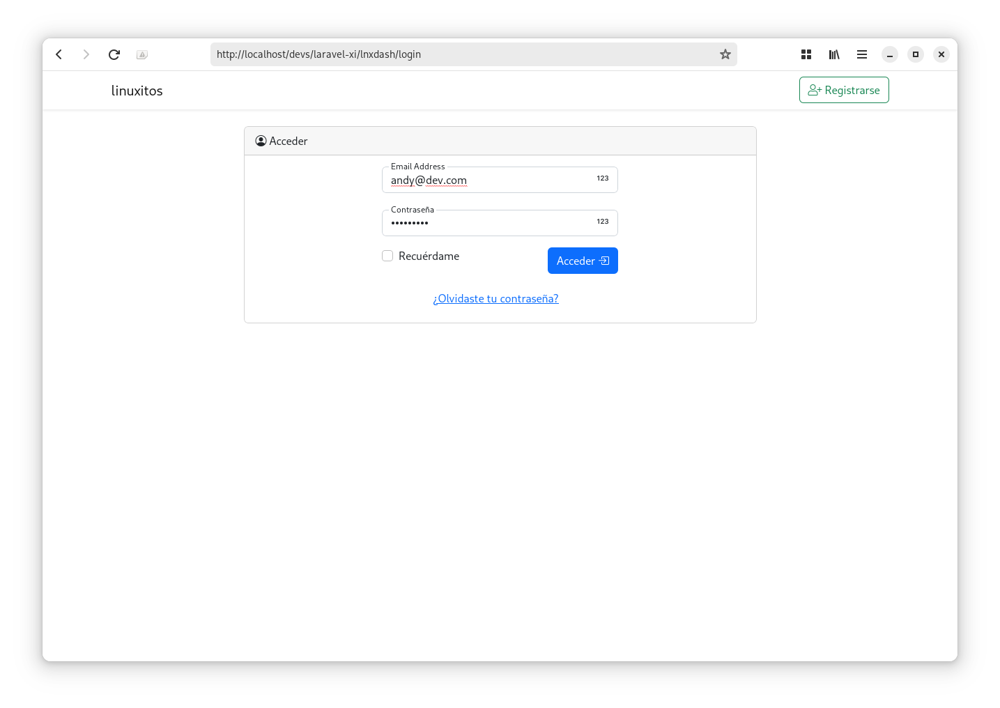
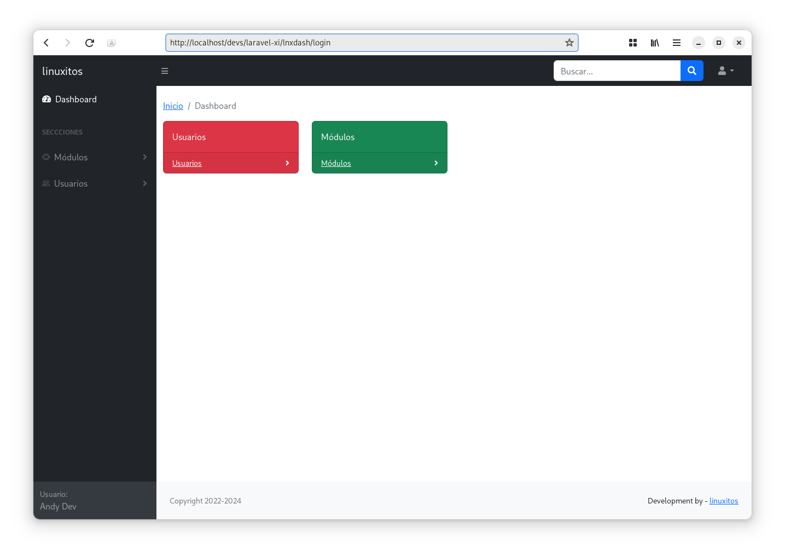
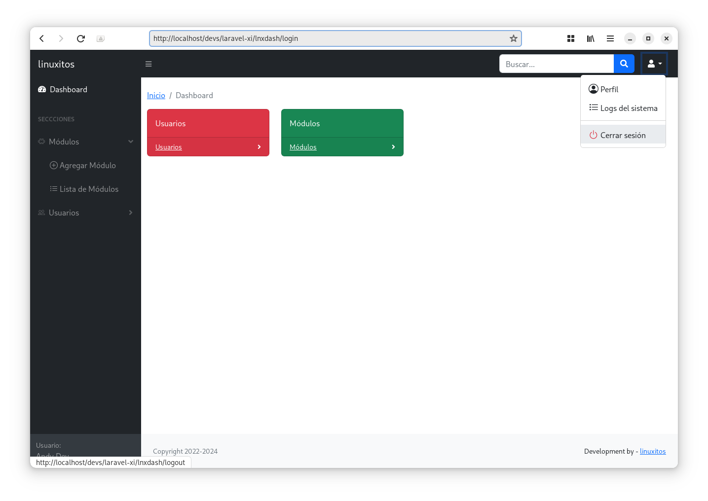

# DashTool


## Descripción

Un dashboar utilizando Laravel 11 con algunas características esenciales desarrolladas a mi manera. Éste proyecto lo utilicé como parte de la facultad, por lo que sólo lo actualicé a la versión más reciente de Laravel, para compartirlo con ustedes.

## Funcionalidades

- Control de permisos
- Control de usuario
- Control de módulos
- Uso ajax
- PHP > 8.2
- Buscador con ajax
- Login
- Registro
- Recuperación de contraseña
- Uso de imágenes

## Requerimientos

- Composer
- GIT (opcional)
- XAMPP > 8.2 ó PHP nativo > 8.2

## Implementación
- Clonar el proyecto en la ruta de xampp/htdocs/ si se usa laragon o algún otro servidor de PHP, ubicarlo en el directorio por defecto.

```
git clone https://gitlab.com/linuxitos/dashtool.git
```

Remombrar el proyecto clonado a `dashtool` 

- Ejecutar composer install

```
composer install
```

- Si se usa XAMPP crear la base de datos con nombre **dashtool**
- Cambiar el nombre del archivo env => .env
- Configurar los datos de la base de datos

```
DB_CONNECTION=mysql
DB_HOST=127.0.0.1
DB_PORT=3306
DB_DATABASE=dashtool
DB_USERNAME=root
DB_PASSWORD=
```

- Configurar la url del proyecto de acuerdo a la ruta donde lo tengan almacenado, por defecto en xampp htdocs/

Abrir el archivo .env y buscar la línea:

```
APP_URL=http://localhost/dashtool/
```

Modificar en caso de ser necesario.


- Ejecutar migraciones de base de datos desde laravel

Para ésto, entrar al directorio del proyecto, y ejecutar los siguientes comandos:

```
php artisan migrate:fresh --seed
```

- Para iniciar el proyecto no requiere php artisan serve, solo basta con abrir el navegador y abrir la url: <http://localhost/dashtool>

- Por defecto se crea el siguiente usuario y contraseña:

```
andy@dev.com
holamundo
```

- Si usar alguna distro linux, necesitas asignarle permiso a la cerpeta del proyecto.

Asignar permisos al proyecto para el usuario, tu-usuario cambiarlo por el nombre del usuario que se utilice

Para ésto, desde la terminal ejecutar:

** cambiar la ruta /opt/lampp/htdocs/ por la ruta donde esté instalado xampp, por si no está en la ruta por defecto.

```
sudo chown -R daemon:tu-usuario /opt/lampp/htdocs/dashtool
```

Asignar permisos al directorio del proyecto.

```
sudo chmod 775 -R /opt/lampp/htdocs/dashtool
```


## Pruebas
Para las pruebas correspondientes abrir el navegador con la ruta que se configure:

<http://localhost/dashtool>

* El correo por defecto para usuario root es andy@dev.com y contraseña es holamundo

## Capturas







## MIT License

License: MIT

[](https://opensource.org/licenses/MIT)

#### Developed By
----------------
 * linuxitos - <contact@linuxitos.com>